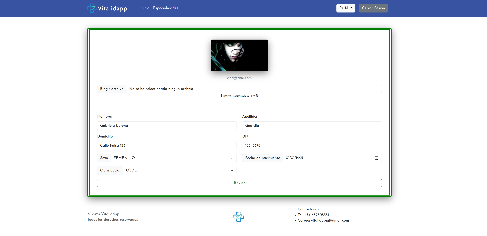
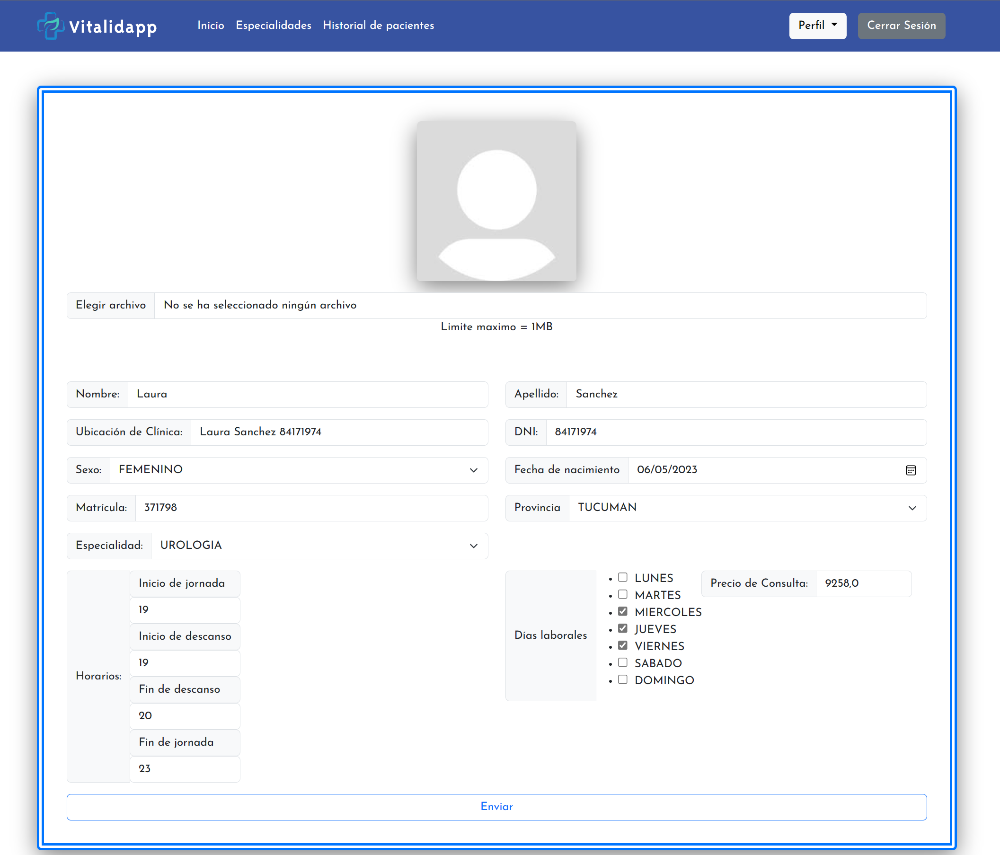
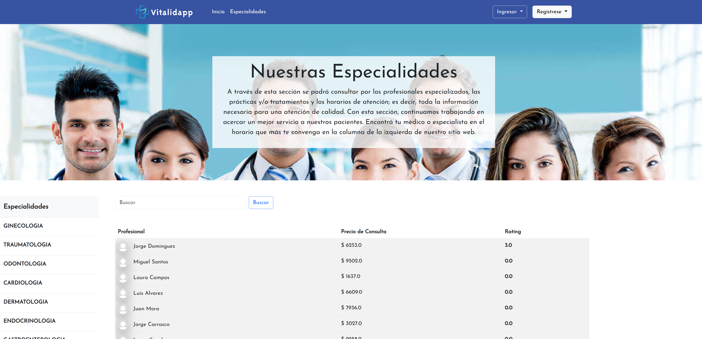
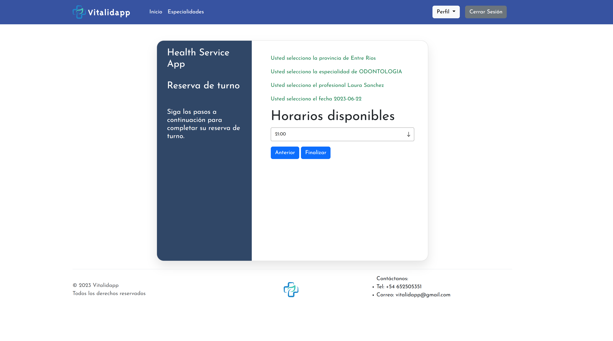
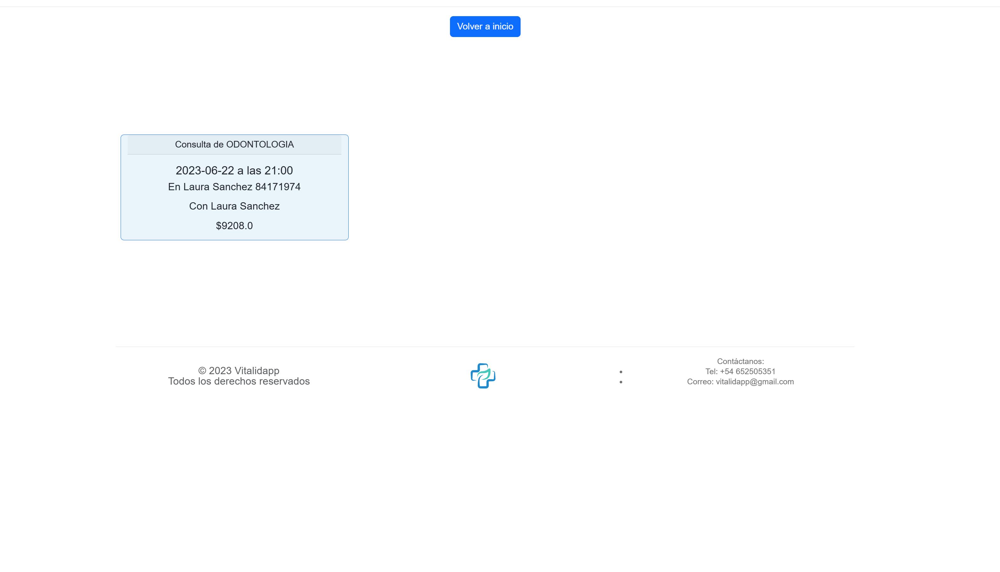
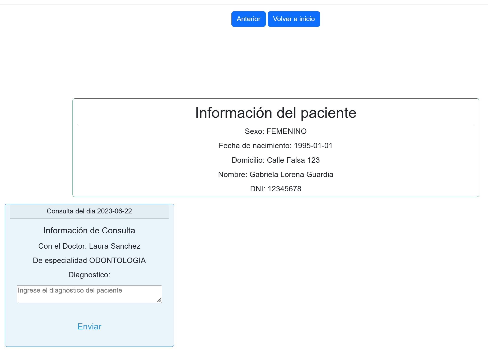
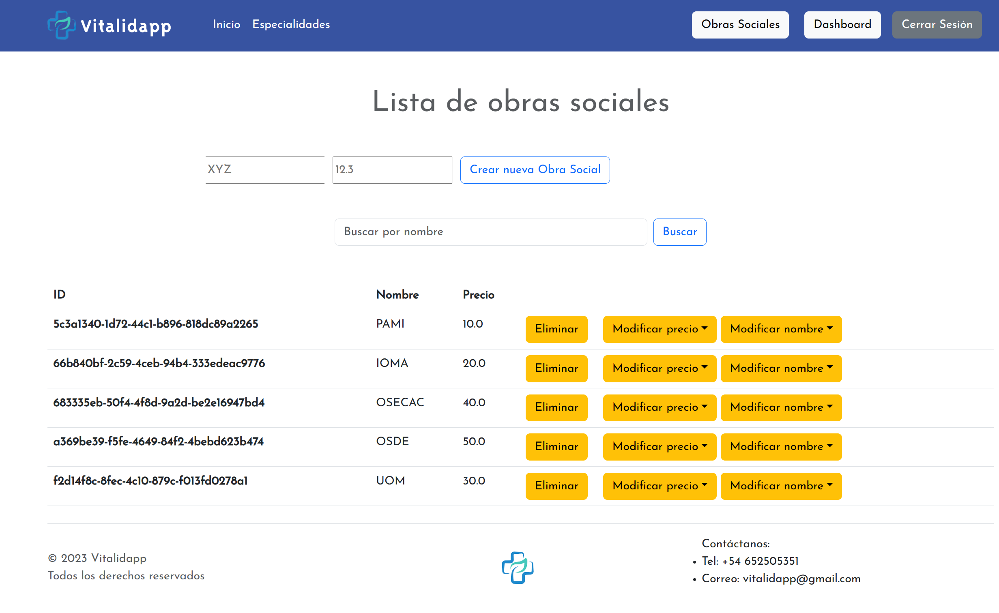

# VitalyApp
Este proyecto es parte del curso Fullstack Web Developer de EGG Cooperation y tiene como objetivo desarrollar una plataforma de provisión de servicios de salud para pacientes.

La aplicación permitirá a un colectivo de profesionales de la salud auto-organizados administrar sus servicios y facilitar a los pacientes la búsqueda y reserva de turnos médicos.

A través de esta solución, buscamos abordar la dificultad para conseguir turnos y garantizar la integridad de la historia clínica de los pacientes.

## Características

- Registro y Login: Los usuarios podrán registrarse e iniciar sesión en la aplicación para acceder a las funcionalidades.
- Gestión de Perfil: Los usuarios podrán cargar y modificar sus datos personales, incluyendo información de contacto y preferencias.
- Imagen de Perfil: Los usuarios podrán cargar una imagen para personalizar su perfil.
- Búsqueda de Profesionales: Los pacientes podrán buscar profesionales por especialidad, filtrar los resultados y visualizar información relevante de cada profesional.
- Reserva y Cancelación de Turnos: Los pacientes podrán agendar y cancelar turnos con los profesionales disponibles.
- Vista de Consultas Previas: Los pacientes podrán acceder a un registro de consultas previas realizadas con los profesionales.
- Puntuación de Consultas: Los pacientes podrán proporcionar un puntaje a las consultas realizadas.
- Cambio de Roles: La aplicación permitirá asignar diferentes roles a los usuarios, como Administrador, Profesional o Paciente, con distintos niveles de acceso y funcionalidades.
- Vista de Historial de Consultas: Los profesionales podrán acceder a un historial de consultas realizadas con los pacientes, con información detallada de cada visita.
- Gestión de Obras Sociales: Los profesionales podrán cargar, modificar y eliminar información relacionada con las obras sociales con las que trabajan.

## Tecnologias

*Cliente:* Bootstrap, Javascript

*Server:* JAVA, Springboot, MySQL, Thymeleaf

*Code editor:* Visual Studio Code

## Screenshots

|     |     |     |
| --- | --- | --- |
|  |  |  |
|  |  |  |
|  |  |  |


## Correr localmente

Clonar el proyecto

```bash
git clone https://github.com/davichuder/VitalidApp
```

Ejecutar el script de MySQL para la creacion de la base de datos

Ubicado en 
```bash
health-service-app\script-mysql\healthservicedb.sql
```

Abrir la carpeta del proyecto con VS Code, y abrir al archivo
```bash
HealthServiceAppApplication.java
```
Luego puede clickear sobre "Run" que aparecera sobre el metodo "main"
O dirigirse a la pestaña "Run" y luego clickear sobre "Start Debugging"

Una vez hecho esto ingrese a la siguiente direccion, y disfrute de VitalidApp:
```bash
http://localhost:8181/
```
## Presentacion en Youtube

[](https://youtu.be/q-ep-VNLlgA)

## Autores

- [Alexandro Moroz](https://github.com/AlexandroMoroz)
- [Bruno Moyano](https://github.com/BEMP1)
- [Matias Speroni](https://github.com/MattVmx)
- [Ramiro Villagra](https://github.com/RamiroVillagra)
- [Agustin Vazquez](https://github.com/avazquez99)
- [David Rolón](https://github.com/davichuder)
